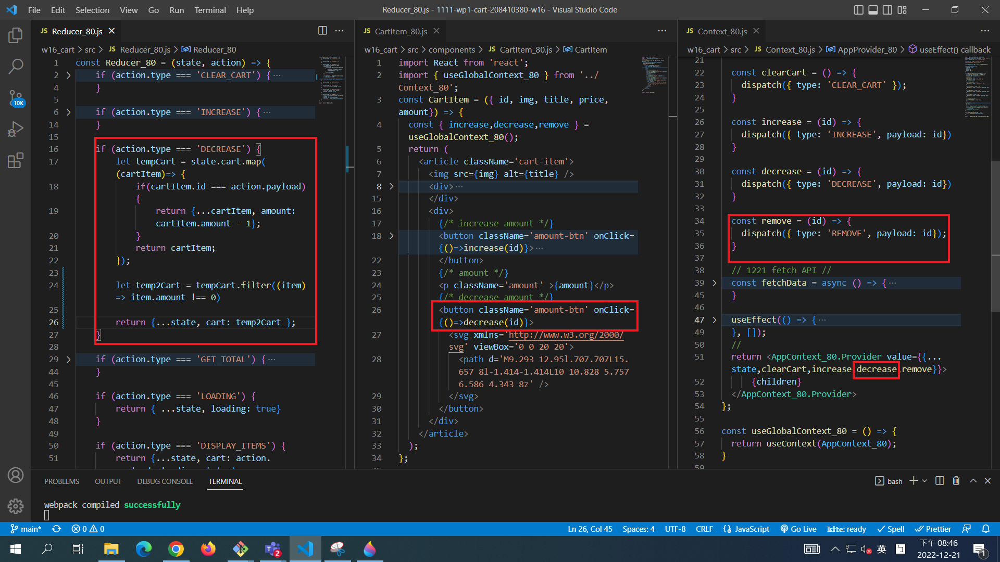
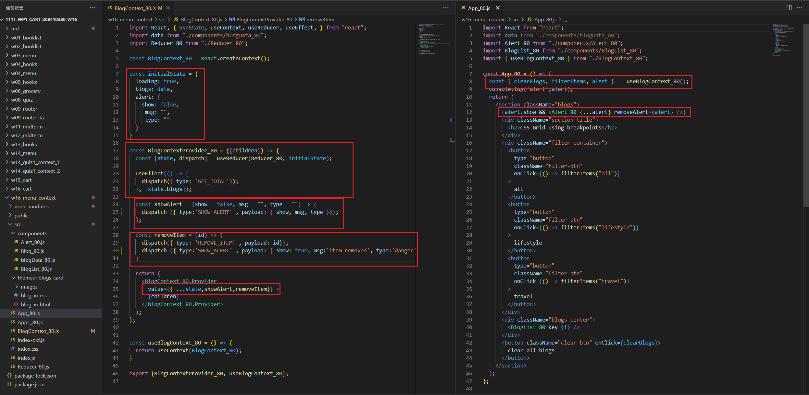
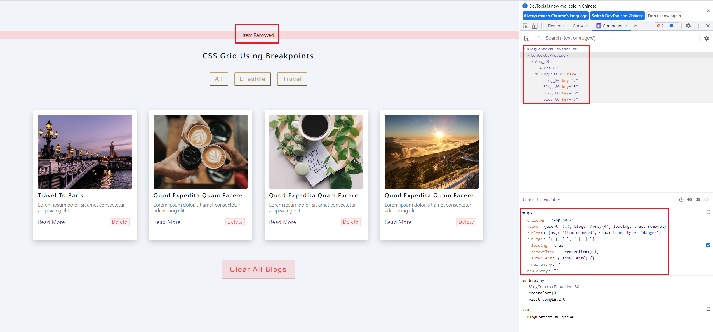

[Github URL] ()

### W16-P1: fetch cart data from url (API)

### W16-P2: W16-P2: remove cart item

### W16-P3: 

### W16-P4: 

### W16-P5: put remove cart item function in global context 
 

 

### W15-P6: provide decrease function in global context
 

 

git log --pretty=format:"%h%x09%an%x09%ad%x09%s" --after="2022-12-20"